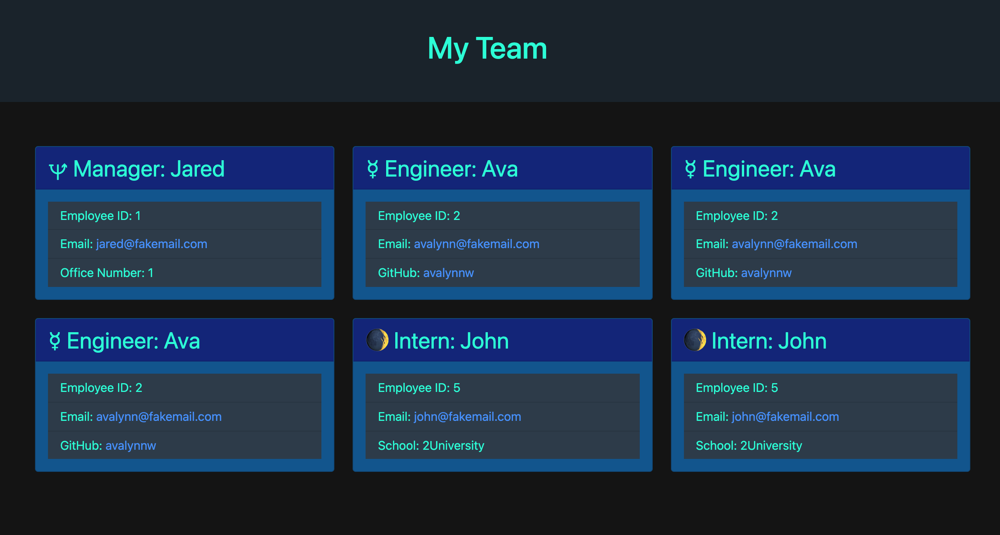

# Team Profile Generator

## Description

This program is desinged to generate an html page based on user input through a command line in order to create a team profile.

## Table of Contents

- [Installation](#installation)
- [Usage](#usage)
- [Contributing](#contributing)
- [License](#license)
- [Tests](#tests)
- [Questions](#questions)

## Installation

Clone this project your personal computer using the command: 

	git clone git@github.com:avalynnw/Team-Profile-Generator.git 

Then, use: 

	npm install {package-name}

 to install inquirer and jest in the root directory.

## Usage

Run the program from the root directory using:

	node index.js

 and fill out the prompts to generate the html file to the /dist directory.

## [Deployed Site](https://avalynnw.github.io/Team-Profile-Generator/)

## Contributing

Collaborators: Avalynn Helgrave, https://github.com/avalynnw

Third-Party Assets: Modules: inquirer, jest

## License

#### The Unlicense

http://unlicense.org/

## Tests

Install jest

	npm install jest

Run tests using:

	npm run test

## Questions

https://github.com/avalynnw

 Contact me at: avalynnjudge@gmail.com